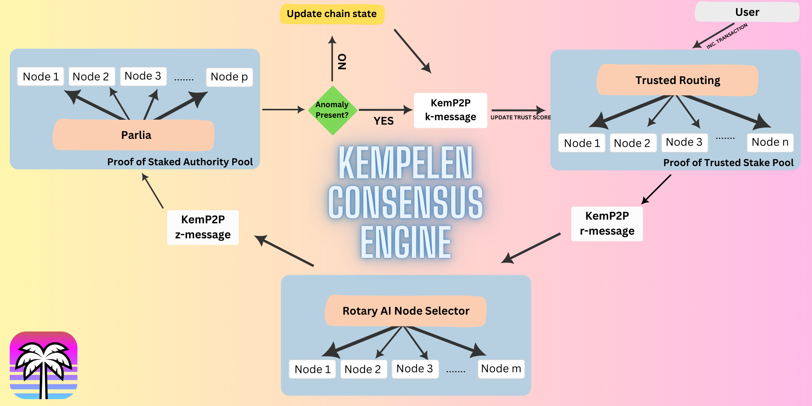

## Miami Network
Miami Network is an EVM blockchain that combines blockchain technology with artificial intelligence to create a new multi-pool consensus engine called Kempelen Consensus Engine. This engine features a distributed, intelligent block validator assignment process that eliminates human involvement in the upkeep and security of the chain while boosting scalability. It also enables a routing protocol that fetches the node that suits the user’s transaction patterns, allowing for optimized processing on the validator machines.

Miami Network aims to improve upon Parlia by using deep learning and neural networks to automate and enhance the authority assignment process. Miami Network also implements a routing protocol that matches the user’s transaction patterns with the best node for faster and more efficient processing.

Miami Network's skeleton pool uses parlia in order to establish a secure consensus base, ensuring network longevity.



## What is the Kempelen Consensus Engine?

Kempelen Consensus Engine has 4 main parts:

 - Multi-Pool Consensus Scheme
   - Pool #1: PoTS
	   -   A pool of validators with voting power weighted based on their trust score and staked amount. Optimized for high scalability.
	   Transactions they receive are routed to the Kempelen AI pool using
	   KemP2P.
   - Pool #2: Kempelen AI
	   - A pool of Open AI nodes that classifies anomalies on transactions sent by PoTS pool. The classifier results are sent to the PoSA pool
   along with the transaction data.
   - Pool #3: PoSA
	   - The skeleton validator set for Miami Network. Out of 34 validators, 21 are picked after each epoch. Reconfiguration over Parlia consensus algorithm.

 -   KemP2P
	 - Communication and routing protocol built on top of EVM’s DevP2P, forming the low level messaging network between validator pools.
 
 -	Kempelen Nodes
	 -	Open AI nodes configured specifically to receive and cluster transaction data into types of possible incoming attacks to the network security (Sybil, DDoS, etc). Users can create and deploy their own AI implementations to detect these attacks, and receive rewards.

## Native Token

VIBE will run on Miami Network in the same way as ETH runs on Ethereum so that it remains as `native token` for Miami Network. This means,
VIBE will be used to:

1. pay `gas` to deploy or invoke Smart Contract on Miami Network
2. perform cross-chain operations, such as transfer token assets across chains.

## Building the source

Many of the below are the same as or similar to go-ethereum and bnb-chain.

For prerequisites and detailed build instructions please read the [Installation Instructions](https://geth.ethereum.org/docs/getting-started/installing-geth).

Building `geth` requires both a Go (version 1.19 or later) and a C compiler. You can install
them using your favourite package manager. Once the dependencies are installed, run

```shell
make geth
```

or, to build the full suite of utilities:

```shell
make all
```

If you get such error when running the node with self built binary:
```shell
Caught SIGILL in blst_cgo_init, consult <blst>/bindinds/go/README.md.
```
please try to add the following environment variables and build again:
```shell
export CGO_CFLAGS="-O -D__BLST_PORTABLE__" 
export CGO_CFLAGS_ALLOW="-O -D__BLST_PORTABLE__"
```

## Executables

The bsc project comes with several wrappers/executables found in the `cmd`
directory.

|  Command   | Description                                                                                                                                                                                                                                                                                                                                                                                                                                                                                                                                                                                     |
| :--------: | ----------------------------------------------------------------------------------------------------------------------------------------------------------------------------------------------------------------------------------------------------------------------------------------------------------------------------------------------------------------------------------------------------------------------------------------------------------------------------------------------------------------------------------------------------------------------------------------------- |
| **`geth`** | Main Miami Network client binary. It is the entry point into the 
network (main-, test- or private net), capable of running as a full node (default), archive node (retaining all historical state) or a light node (retrieving data live). It has the same and more RPC and other interface as go-ethereum and can be used by other processes as a gateway into the Miami network via JSON RPC endpoints exposed on top of HTTP, WebSocket and/or IPC transports. `geth --help` and the [CLI page](https://geth.ethereum.org/docs/interface/command-line-options) for command line options. |
|   `clef`   | Stand-alone signing tool, which can be used as a backend signer for `geth`.                                                                                                                                                                                                                                                                                                                                                                                                                                                                                                                     |
|  `devp2p`  | Utilities to interact with nodes on the networking layer, without running a full blockchain.                                                                                                                                                                                                                                                                                                                                                                                                                                                                                                    |
|  `abigen`  | Source code generator to convert Ethereum contract definitions into easy to use, compile-time type-safe Go packages. It operates on plain [Ethereum contract ABIs](https://docs.soliditylang.org/en/develop/abi-spec.html) with expanded functionality if the contract bytecode is also available. However, it also accepts Solidity source files, making development much more streamlined. Please see our [Native DApps](https://geth.ethereum.org/docs/dapp/native-bindings) page for details.                                                                                               |
| `bootnode` | Stripped down version of our Ethereum client implementation that only takes part in the network node discovery protocol, but does not run any of the higher level application protocols. It can be used as a lightweight bootstrap node to aid in finding peers in private networks.                                                                                                                                                                                                                                                                                                            |
|   `evm`    | Developer utility version of the EVM (Ethereum Virtual Machine) that is capable of running bytecode snippets within a configurable environment and execution mode. Its purpose is to allow isolated, fine-grained debugging of EVM opcodes (e.g. `evm --code 60ff60ff --debug run`).                                                                                                                                                                                                                                                                                                            |
| `rlpdump`  | Developer utility tool to convert binary RLP ([Recursive Length Prefix](https://eth.wiki/en/fundamentals/rlp)) dumps (data encoding used by the Ethereum protocol both network as well as consensus wise) to user-friendlier hierarchical representation (e.g. `rlpdump --hex CE0183FFFFFFC4C304050583616263`).                                                                                                                                                                                                                                                                                 |

## Running `geth`

Going through all the possible command line flags is out of scope here (please consult our
[CLI Wiki page](https://geth.ethereum.org/docs/fundamentals/command-line-options)),
but we've enumerated a few common parameter combos to get you up to speed quickly
on how you can run your own `geth` instance.

### Hardware Requirements

The hardware must meet certain requirements to run a full node on mainnet:
- VPS running recent versions of Mac OS X, Linux, or Windows.
- IMPORTANT 2 TB of free disk space, solid-state drive(SSD), gp3, 8k IOPS, 250 MB/S throughput, read latency <1ms. (if node is started with snap sync, it will need NVMe SSD)
- 16 cores of CPU and 64 GB of memory (RAM)
- Suggest m5zn.3xlarge instance type on AWS, c2-standard-16 on Google cloud.
- A broadband Internet connection with upload/download speeds of 5 MB/S

The requirement for testnet:
- VPS running recent versions of Mac OS X, Linux, or Windows.
- 500G of storage for testnet.
- 4 cores of CPU and 8 gigabytes of memory (RAM).

### Steps to Run a Fullnode

#### 1. Download the pre-build binaries (bnb-chain)
```shell
# Linux

wget $(curl -s https://api.github.com/repos/bnb-chain/bsc/releases/latest |grep browser_ |grep geth_linux |cut -d\" -f4)
mv geth_linux geth
chmod -v u+x geth

# MacOS
wget $(curl -s https://api.github.com/repos/bnb-chain/bsc/releases/latest |grep browser_ |grep geth_mac |cut -d\" -f4)
mv geth_mac geth
chmod -v u+x geth
```

#### 2. Download the config files
```shell
# Will be included soon
```

#### 3. Start a full node
```shell
./geth --config ./config.toml --datadir ./node  --cache 8000 --rpc.allow-unprotected-txs --txlookuplimit 0

## It is recommand to run fullnode with `--tries-verify-mode none` if you want high performance and care little about state consistency
./geth --config ./config.toml --datadir ./node  --cache 8000 --rpc.allow-unprotected-txs --txlookuplimit 0 --tries-verify-mode none
```

#### 4. Monitor node status

Monitor the log from **./node/bsc.log** by default. When the node has started syncing, should be able to see the following output:
```shell
t=2022-09-08T13:00:27+0000 lvl=info msg="Imported new chain segment"             blocks=1    txs=177   mgas=17.317   elapsed=31.131ms    mgasps=556.259  number=21,153,429 hash=0x42e6b54ba7106387f0650defc62c9ace3160b427702dab7bd1c5abb83a32d8db dirty="0.00 B"
t=2022-09-08T13:00:29+0000 lvl=info msg="Imported new chain segment"             blocks=1    txs=251   mgas=39.638   elapsed=68.827ms    mgasps=575.900  number=21,153,430 hash=0xa3397b273b31b013e43487689782f20c03f47525b4cd4107c1715af45a88796e dirty="0.00 B"
t=2022-09-08T13:00:33+0000 lvl=info msg="Imported new chain segment"             blocks=1    txs=197   mgas=19.364   elapsed=34.663ms    mgasps=558.632  number=21,153,431 hash=0x0c7872b698f28cb5c36a8a3e1e315b1d31bda6109b15467a9735a12380e2ad14 dirty="0.00 B"
```

#### 5. Interact with fullnode
Start up `geth`'s built-in interactive [JavaScript console](https://geth.ethereum.org/docs/interface/javascript-console),
(via the trailing `console` subcommand) through which you can interact using [`web3` methods](https://web3js.readthedocs.io/en/) 
(note: the `web3` version bundled within `geth` is very old, and not up to date with official docs),
as well as `geth`'s own [management APIs](https://geth.ethereum.org/docs/rpc/server).
This tool is optional and if you leave it out you can always attach to an already running
`geth` instance with `geth attach`.

### Configuration

As an alternative to passing the numerous flags to the `geth` binary, you can also pass a
configuration file via:

```shell
$ geth --config /path/to/your_config.toml
```

To get an idea how the file should look like you can use the `dumpconfig` subcommand to
export your existing configuration:

```shell
$ geth --your-favourite-flags dumpconfig
```

### Programmatically interfacing `geth` nodes

As a developer, sooner rather than later you'll want to start interacting with `geth` and the
BSC network via your own programs and not manually through the console. To aid
this, `geth` has built-in support for a JSON-RPC based APIs ([standard APIs](https://ethereum.github.io/execution-apis/api-documentation/)
and [`geth` specific APIs](https://geth.ethereum.org/docs/interacting-with-geth/rpc)).
These can be exposed via HTTP, WebSockets and IPC (UNIX sockets on UNIX based
platforms, and named pipes on Windows).

The IPC interface is enabled by default and exposes all the APIs supported by `geth`,
whereas the HTTP and WS interfaces need to manually be enabled and only expose a
subset of APIs due to security reasons. These can be turned on/off and configured as
you'd expect.

HTTP based JSON-RPC API options:

* `--http` Enable the HTTP-RPC server
* `--http.addr` HTTP-RPC server listening interface (default: `localhost`)
* `--http.port` HTTP-RPC server listening port (default: `8545`)
* `--http.api` API's offered over the HTTP-RPC interface (default: `eth,net,web3`)
* `--http.corsdomain` Comma separated list of domains from which to accept cross origin requests (browser enforced)
* `--ws` Enable the WS-RPC server
* `--ws.addr` WS-RPC server listening interface (default: `localhost`)
* `--ws.port` WS-RPC server listening port (default: `8546`)
* `--ws.api` API's offered over the WS-RPC interface (default: `eth,net,web3`)
* `--ws.origins` Origins from which to accept WebSocket requests
* `--ipcdisable` Disable the IPC-RPC server
* `--ipcapi` API's offered over the IPC-RPC interface (default: `admin,debug,eth,miner,net,personal,txpool,web3`)
* `--ipcpath` Filename for IPC socket/pipe within the datadir (explicit paths escape it)

You'll need to use your own programming environments' capabilities (libraries, tools, etc) to
connect via HTTP, WS or IPC to a `geth` node configured with the above flags and you'll
need to speak [JSON-RPC](https://www.jsonrpc.org/specification) on all transports. You
can reuse the same connection for multiple requests!

**Note: Please understand the security implications of opening up an HTTP/WS based
transport before doing so! Hackers on the internet are actively trying to subvert
BSC nodes with exposed APIs! Further, all browser tabs can access locally
running web servers, so malicious web pages could try to subvert locally available
APIs!**


## License

The bsc library (i.e. all code outside of the `cmd` directory) is licensed under the
[GNU Lesser General Public License v3.0](https://www.gnu.org/licenses/lgpl-3.0.en.html),
also included in our repository in the `COPYING.LESSER` file.

The bsc binaries (i.e. all code inside of the `cmd` directory) is licensed under the
[GNU General Public License v3.0](https://www.gnu.org/licenses/gpl-3.0.en.html), also
included in our repository in the `COPYING` file.
